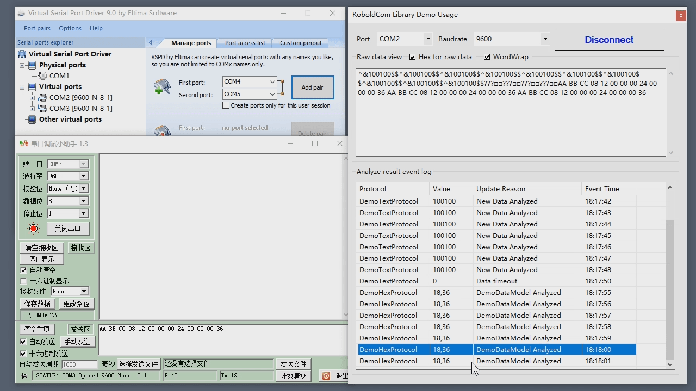

[中文](README.md)

# KoboldCom

KoboldCom is a C# serial-port library: receive bytes, match one or more protocols, and map complete frames onto your data models.

“Async” here means the `SerialPort.DataReceived` event-driven receive/parse pipeline, **not** C# `async` / `await`.

## Features

- Serial open, read/write, and raw receive (`Communicator` + `SerialPort`)
- Built-in `HexProtocolAnalyzer` (binary frames) and `TextProtocolAnalyzer` (begin/end text frames)
- Several protocols on one port; each analyzer maps a frame to your model
- Optional checksums: text `CheckData` (for example NMEA XOR); hex 1-byte or 2-byte (`CheckData` / `CheckData16`)
- With `Handshake.None`, RTS/DTR default high so some no-handshake devices can answer `Write`

## Requirements and versioning

The current mainline needs the [.NET 8 SDK](https://dotnet.microsoft.com/download). 2.0.0 is an intentional major-version break.

| Line | Target | Where to get it |
| --- | --- | --- |
| **1.x** | .NET Framework 3.5 | Tag [`v1.1.0`](https://github.com/PeterRock/KoboldCom/releases/tag/v1.1.0). If you also need the later 2-byte hex checksum and Handshake.None RTS/DTR work, use branch [`netfx-1.x`](https://github.com/PeterRock/KoboldCom/tree/netfx-1.x). Do not move a Framework app to 2.x. |
| **2.x** (current) | `net8.0` + NuGet `System.IO.Ports` | Current `master`, assembly version **2.0.0**. Includes the 1.x protocol/serial behavior above. Framework 3.5 projects cannot reference 2.x. |

The public C# API and Chinese XML docs are kept as stable as practical. See [CHANGELOG.md](CHANGELOG.md) for the finer points.

Port names are still Windows-style `COM` + number (`SerialPortSetting.Port`). The Demo is `net8.0-windows` WinForms and runs on Windows only.

## Quick start

```bash
dotnet build KoboldCom.sln

dotnet run --project verify/TextProtocolAnalyzerCheckData
dotnet run --project verify/HexProtocolAnalyzerCheckLength
dotnet run --project verify/SerialPortHandshakeNone
```

The three `verify` projects need no hardware. They cover text checksums, hex checksum length, and Handshake.None RTS/DTR defaults.

On Windows, open the Demo:

```bash
dotnet run --project Demo
```

Non-Windows machines can cross-compile the Demo (`EnableWindowsTargeting` is on) but cannot run the UI. Full multi-protocol usage is in [`Demo/`](Demo/).

## Concepts

The pipeline is:

`SerialPort.DataReceived` → `Communicator` reads bytes → each `IAnalyzer.SearchBuffer` cuts a frame → `Analyze()` maps the model

`Communicator` holds an `ICommunication` (usually `KoboldCom.SerialPort`) and an `IAnalyzerCollection`. Incoming bytes raise `OnRawDataReceived`, then every analyzer searches the buffer.

Subscribe to these two events in application code:

| Event | On | When |
| --- | --- | --- |
| `OnRawDataReceived` | `Communicator` | A chunk of raw bytes was just read |
| `OnDataAnalyzed` | A concrete `ProtocolAnalyzer<T>` | The subclass sets `Valid = true` (or later timeout sets `Valid` back to `false`) |

`ICommunication.OnDataReceived` is the lower-level “bytes available” hook. `Communicator` already handles it.

```csharp
var protocols = new MyProtocols();
var communicator = new Communicator(new KoboldCom.SerialPort(), protocols);

communicator.OnRawDataReceived += bytes => { /* raw bytes */ };
protocols.ProtocolText.OnDataAnalyzed += m => { /* text model */ };
protocols.ProtocolBinary.OnDataAnalyzed += m => { /* hex model */ };

communicator.Com.Open(new SerialPortSetting { Port = 2, Baudrate = 9600 });
```

`SerialPortSetting` defaults to `Handshake = None`, `RtsEnable = true`, and `DtrEnable = true`. Those flags are written when `Setting` is applied and again after `Open`. If `Handshake` is not `None`, the OS handshake owns the lines; the library does not write them, and the getter reports them inactive. Set a flag to `false` if that line must stay low.

## Protocols

A typical binary frame looks like:

```
header + length + payload + checksum
AA 44 05 01 02 03 04 05 EA
```

A typical text sentence looks like:

```
$GPGGA,121252.000,3937.3032,N,11611.6046,E,1,05,2.0,45.9,M,-5.7,M,,0000*75
```

`$` starts the sentence, `*` ends it, and `75` is the XOR of the characters between `$` and `*`. Those two shapes map to `HexProtocolAnalyzer` and `TextProtocolAnalyzer`. Configure framing in the subclass **constructor**, map `Raw` to `Data` in `Analyze()`, then set `Valid = true`.

### Text: `TextProtocolAnalyzer`

Frame: `[BeginOfLine][payload][EndOfLine]`, optionally plus checksum: `[EndOfLine][check]`.

- Leave `CheckData` unset for no checksum (the Demo `^&100$$` protocol does this)
- `EndOfLine` is searched **after** `BeginOfLine`, so an earlier leftover terminator is ignored
- A complete frame with a bad checksum is not a valid packet and is dropped from the buffer; a later good frame can still match

NMEA-style `$...*HH`:

```csharp
public class NmeaProtocol : TextProtocolAnalyzer<MyModel>
{
    public NmeaProtocol()
    {
        BeginOfLine = "$";
        EndOfLine = "*";
        CheckData = XorCheck; // CheckLength defaults to 2 hex ASCII digits after *
    }

    public override void Analyze() { /* Raw → Data; Valid = true; */ }
}
```

`CheckLength = 1` compares one raw byte after `EndOfLine`. Edge cases live in `verify/TextProtocolAnalyzerCheckData`.

### Hex: `HexProtocolAnalyzer`

Frame: `[Mask][length][data][checksum]`. Defaults are `CheckLength = 1` and `CheckData = XorCheck`, so existing 1-byte XOR/SUM protocols stay the same.

```csharp
public class DemoHex : HexProtocolAnalyzer<DemoDataModel>
{
    public DemoHex()
    {
        Mask = new byte[] { 0xAA, 0xBB, 0xCC };
        CheckData = SumCheck; // still a 1-byte trailer by default
    }

    public override void Analyze() { /* Raw → Data; Valid = true; */ }
}
```

For a 2-byte checksum, set this in the subclass constructor:

```csharp
CheckLength = 2;
CheckData16 = Crc16Modbus; // or SumCheck16; returns a 16-bit host value
// Compared little-endian (low byte first) by default, matching Modbus CRC-16
// High byte first: CheckBigEndian = true;
```

If `CheckData16` is unset, the 1-byte `CheckData` result is compared as a 16-bit value. `CheckLength <= 0` means the frame has no checksum field. Use `StaticLength` for fixed-length frames. Details: `verify/HexProtocolAnalyzerCheckLength` and `Demo/DemoHexProtocol.cs`.

## Extending

If neither built-in analyzer fits, subclass abstract `ProtocolAnalyzer<T>`:

- Override `SearchBuffer` to cut one frame from the `List<byte>` into `Raw`, and remove consumed bytes from the buffer
- Implement `Analyze()` for the model mapping

`HexProtocolAnalyzer` and `TextProtocolAnalyzer` already implement `SearchBuffer`. Most apps only set framing/checksums and override `Analyze()`. Put several analyzers in your own `IAnalyzerCollection` (see `Demo/MyProtocols.cs`) to run them together.

## Demo



The WinForms sample runs the text protocol `^&…$$` and the hex protocol `AA BB CC …` at the same time, and lists `OnDataAnalyzed` results. Source: [`Demo/`](Demo/).

## Serial debug

[Windows virtual serial ports and debugging](https://www.petershi.net/archives/2885)

## Thanks

The idea started from [this article](http://blog.csdn.net/wuyazhe/article/details/5598945).

## License

[MIT](LICENSE)
